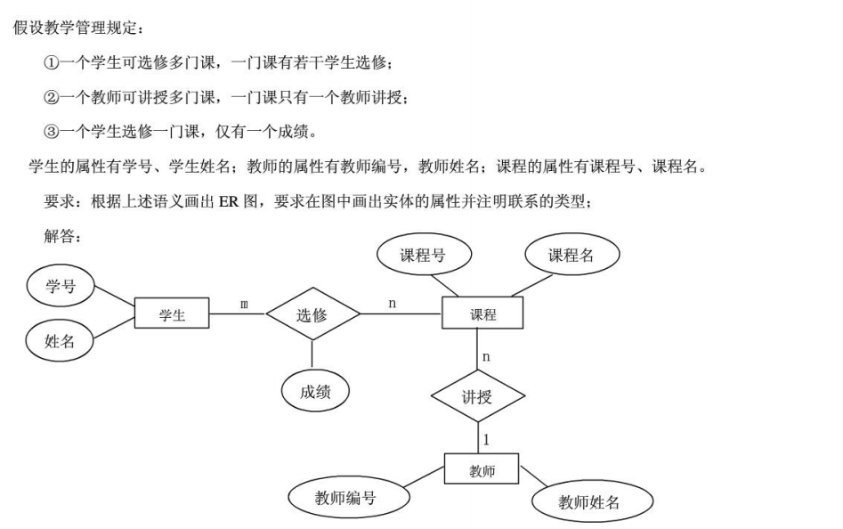

:::: titlepage
**数据库笔记**\
烂石\

::: flushleft
{width="50%"}
:::

2025-03-04
::::

# 第一章:绪论

## 数据库的4个基本概念

1.  数据data

2.  数据库database,DB

3.  数据库管理系统DBMS

4.  数据库系统DBS

## 数据库系统的特点

1.  结构化

2.  共享性高,低冗余,易扩充

3.  数据独立性高:物理;逻辑

4.  由DBMS统一管理和控制

## 数据模型

1.  概念模型-E-R图

2.  逻辑模型--关系模型

3.  物理模型

## 数据模型的组成要素:数据结构,数据操作,数据的完整性约束条件

1.  数据结构-静态

2.  数据操作-动态

3.  完整性约束条件

## **重点:数据库系统的三级模式结构:外模式,模式(逻辑模式),内模式**

1.  外模式:外模式是用户或应用程序看到的局部数据逻辑结构，也称为用户视图。每个外模式为特定用户组定制，屏蔽了数据库的复杂结构。例如，不同用户可能通过不同的外模式访问同一数据库的不同部分。

2.  模式:模式是数据库的全局逻辑结构，定义所有数据实体、属性、关系及约束（如主键、外键）。例如，包含所有表的结构及其联系，是数据库设计的核心蓝图。

3.  内模式:内模式描述数据的物理存储方式，如文件组织、索引结构、数据压缩等。

## 数据库的二级印象功能与逻辑独立性

1.  外模式/模式:保证了数据的逻独立性

2.  模式/内模式:保证了 物理独立性

# 第四章:数据库安全性(授权)

## 不安全因素

1.  非法访问：未经授权的用户入侵数据库。

2.  恶意软件：病毒、木马等可能破坏数据完整性。

3.  数据泄露：配置不当或外部攻击导致敏感信息暴露。

## 数据库安全性控制

-   用户身份认证与授权管理

-   数据加密传输与存储

-   安全审计与日志记录

-   定期漏洞扫描与风险评估

## **为什么授权?**

**授权是指授予(GRANT)和收回(REVOKE)，自主存取控制的方法，为了保护数据库防止不合法使用导致数据泄露、更改或破坏。**

## **如何授权:授予GRANT**

``` {.sql language="SQL"}
GRANT 权限 ON 对象类型 对象名 TO 用户名 [WITH GRANT OPTION];
```

权限

:   数据库访问的各种操作权限，例如 SELECT, INSERT, UPDATE, DELETE,
    CREATE, ALTER, DROP，及ALL PRIVILEGES。

对象类型

:   数据库中用于授权的对象类型，如 TABLE, DATABASE, VIEW, FUNCTION,
    PROCEDURE 等。

对象名

:   具体数据库对象的名称，或使用\*表示全局权限。

TO 用户名

:   指定接受权限的用户或角色；多个用户可用逗号分隔。

WITH GRANT OPTION

:   允许被授予权限的用户进一步将权限授权他人。

#### 示例 {#示例 .unnumbered}

1.  给用户 user1 授予 employees 表的 SELECT 权限:

    ``` {.sql language="SQL"}
    GRANT SELECT ON TABLE employees TO user1;
    ```

2.  授予 user1 对整个数据库 testDB 查看所有表的 SELECT 权限：

    ``` {.sql language="SQL"}
    GRANT SELECT ON ALL TABLES IN SCHEMA testDB TO user1;
    ```

3.  给用户 admin 授予所有权限并允许转授：

    ``` {.sql language="SQL"}
    GRANT ALL PRIVILEGES ON DATABASE testDB TO admin WITH GRANT OPTION;
    ```

**注意:** SQL 不允许循环授权（不能以下犯上）。

## 收回授权:收回 REVOKE

``` {.sql language="SQL"}
REVOKE 权限 ON 对象类型 对象名 FROM 用户名 [CASCADE][RESTRICT]
```

#### 权限 {#权限 .unnumbered}

用户在数据库中的操作许可，如 SELECT, INSERT, UPDATE, DELETE 等。

#### 对象类型 {#对象类型 .unnumbered}

数据库中的对象，如 TABLE, VIEW, SEQUENCE, PROCEDURE 等。

#### 对象名 {#对象名 .unnumbered}

指定权限语句作用的特定对象名称。

#### 用户名 {#用户名 .unnumbered}

需要撤销权限的用户或角色。

#### CASCADE {#cascade .unnumbered}

若该用户已将权限授予他人，则撤销时级联撤销所有相关权限。

#### RESTRICT {#restrict .unnumbered}

若权限已被他人传递，将阻止撤销操作（CASCADE和RESTRICT只能选择一个）。

#### 示例 {#示例-1 .unnumbered}

``` {.sql language="SQL"}
REVOKE SELECT ON TABLE employees FROM bob CASCADE;
```

该语句撤销用户 bob 的 SELECT 权限，同时撤销通过 bob 传递的相关权限。

# 数据库完整性

## 三大完整性

1.  实体完整性：保证每个表中记录的唯一性，通常通过主键约束实现，防止出现空值或重复值。

2.  参照完整性：确保外键值必须是在主键中存在的值，维护表间数据一致性。

3.  用户定义完整性：按照特定的业务规则，自定义数据的合法性约束，如自定义检查约束、触发器等。

# 数据库编程

## 嵌入式SQL与主语言之间的通信

嵌入式SQL与主语言（如C、Java等）之间的通信主要通过以下几种方式进行：

1.  **SQL $\rightarrow$ 主语言**：

    -   **通信区（Communication Area,
        SQLCA）**：用于报告SQL语句执行的状态和错误信息。SQLCA是一个结构体或类，包含了SQL语句的执行结果、错误码、警告等信息。通过检查SQLCA，主语言程序可以获取SQL语句的执行情况并作出相应的响应。

2.  **主语言 $\rightarrow$ SQL**：

    -   **主变量（Host
        Variables）**：主语言的变量可以直接用在嵌入式SQL语句中，将主语言的数据传递到数据库中。在SQL预处理阶段，这些变量会被相应地绑定到SQL语句中。

3.  **查询结果 $\rightarrow$ 主语言**：

    -   **主变量和游标（Host Variables and
        Cursors）**：查询结果可以通过主变量直接返回，也可以使用游标来遍历返回的结果集。游标允许主语言程序逐行访问SQL查询（如SELECT语句）的结果数据。

**通信区（SQLCA）**：

-   SQLCA提供了一套结构化或对象化的方式来访问SQL语句执行后的状态和错误信息。具体的字段可能包括：
    SQLCODE（SQL代码）：指示了执行SQL操作的状态，正值表示警告，负值表示错误。
    SQLERRM（错误信息）：包含了描述错误或状况的文本信息。

**主变量**：

-   在嵌入式SQL中，可以声明与外部语言兼容的变量，这些变量可以用作输入参数发送到SQL，也可以作为输出接收查询结果的容器。

**游标（Cursors）**：

-   游标是一个控制结构，允许对查询结果集进行逐行或批量操作。它包括声明、打开、获取数据、关闭等几个步骤：
    `DECLARE`：声明游标。 `OPEN`：打开游标执行查询。
    `FETCH`：从游标中获取一行或多行数据。 `CLOSE`：关闭游标释放资源。

## 相关示例代码

下面是一个用C语言与嵌入式SQL（这里假设是使用了一种支持嵌入式SQL的编译器如Pro\*C）的基本示例：

``` {.objectivec language="C"}
#include <stdio.h>
#include <string.h>

EXEC SQL INCLUDE SQLCA;

// 主变量声明
int id;
char name[20];

EXEC SQL BEGIN DECLARE SECTION;
int ID;
char NAME[20];
EXEC SQL END DECLARE SECTION;

int main() {
    EXEC SQL WHENEVER SQLERROR GOTO error;

    // 从用户获取ID
    printf("Enter ID: ");
    scanf("%d", &ID);
    
    // 查询语句，使用变量
    EXEC SQL SELECT name INTO :NAME FROM Employee WHERE id = :ID;
    
    // 打印结果
    printf("Employee Name foram ID %d is %s", ID, NAME);
    
    goto end;

error:
    printf("Error: %d - %s", sqlca.sqlcode, sqlca.sqlerrm.sqlerrmc);

end:
    return 0;
}
```

# 数据库设计的步骤

1.  需求分析：明确用户需求、业务流程和数据量预估。

2.  概念结构设计：利用E-R图建立概念模型，确定实体、属性及实体间的关系。

3.  逻辑结构设计：将概念模型转换为逻辑模型，进行规范化处理，并设计相应的用户子模式。

4.  物理结构设计：确定数据存储结构，包括表结构、索引、分区及存储配置等。

5.  数据库实施：搭建数据库环境，部署数据库、数据迁移与初始化。

6.  数据库运行与维护：进行性能调优、数据备份、恢复策略、安全管理等。

# 数据库恢复技术

## 事务的概念

1.  数据库操作序列：定义事务为一组相关数据库操作的集合，作为一个整体执行。

2.  恢复的基本单位和并发控制的基本单位：确保在故障恢复时保持数据一致性和完整性。

## 事务的SQL语句

-   提交：COMMIT

-   回滚：ROLLBACK

-   保存点：SAVEPOINT

## 事务的四个特性

1.  原子性

2.  一致性

3.  隔离性

4.  持续性

## DBS的故障种类

1.  事务内部的故障

2.  系统故障（软故障，如软件错误）

3.  介质故障（硬故障，如硬盘损坏）

4.  计算机病毒及其他安全问题

## 数据库恢复技术

1.  数据转储：采用全量备份与增量备份策略，便于恢复最新数据。

2.  日志记录：登记日志文件，既可按记录为单位，也可按数据块为单位，辅助精确恢复。

# 并发控制

## 并发控制的基本概念

并发控制：通过锁机制（悲观控制）或多版本控制（乐观控制）确保事务的一致性和隔离性。\
封锁：在悲观控制中，事务对数据项加锁，防止其他事务同时访问导致数据不一致。\
数据不一致性:

1.  丢失更新

2.  脏读

3.  不可重复读

4.  幻读

## 封锁的基本概念

排他锁（X锁/写锁）：事务加锁后禁止其他事务对该数据项进行读写。\
共享锁（S锁/读锁）：允许其他事务同时加共享锁读取，但禁止加排他锁进行写操作。\

## 封锁协议

1.  一级封锁协议：事务对数据项加锁后，直到事务结束才释放锁。

2.  严格两段锁协议（Strict
    2PL）：事务在整个执行期间只在结束时统一释放所有锁，避免脏读问题。

3.  两段锁协议（2PL）：事务分为加锁阶段和解锁阶段，加锁阶段期间不释放锁，进入解锁阶段后不能再申请新锁。

## 活锁和死锁

活锁：多个事务不断响应彼此的请求，导致无法有效推进。\
死锁：多个事务形成相互等待关系，导致系统僵持。\
死锁处理方法：

1.  死锁检测：构建等待图，检测循环依赖。

2.  死锁恢复：通过回滚部分事务解除死锁。

3.  死锁预防：采用资源排序、一次性申请所有资源等策略。

## 可串行化调度

可串行化调度：事务执行顺序经过调整后效果等同于某一串行顺序，保证数据的一致性。\

## 两段锁协议(2PL)

两段锁协议：事务执行分为加锁阶段（不释放任何锁）和解锁阶段（统一释放所有锁）。\

## 多版本并发控制（MVCC）

多版本并发控制：通过保存数据的多个版本，使得读操作无需等待写锁，从而提高并发性能。常见于乐观并发控制策略。\

# 关系理论

## 函数依赖

非平凡的函数依赖: 对于函数依赖 $X \rightarrow Y$, 若
$Y \not\subseteq X$, 则称为非平凡的函数依赖.\
平凡的函数依赖: 对于函数依赖 $X \rightarrow Y$, 若 $Y \subseteq X$,
则称为平凡的函数依赖.\
完全函数依赖: 若 $X \rightarrow Y$成立, 且对于任意 $X$ 的真子集 $X'$,
$X' \rightarrow Y$ 均不成立, 则称 $Y$ 对 $X$ 完全依赖.\
部分函数依赖: 若 $X \rightarrow Y$成立, 且存在 $X'$ 为 $X$ 的真子集使得
$X' \rightarrow Y$ 成立, 则称 $Y$ 对 $X$ 部分依赖.\

## 码

候选码:
一个属性集合，满足该集合的属性闭包等于关系中的所有属性，且任一真子集的闭包不等于所有属性.\
求候选码的方法:

1.  确定必须包含的属性: 只出现在依赖左侧的属性或未在依赖中出现的属性.

2.  确定可能包含的属性: 同时出现在依赖左右两侧的属性.

3.  组合构造最小的属性集（候选码），其闭包为整个关系.

例题:

1.  $R(A, B, C, D, E)$,
    $F = \{A \rightarrow B, B \rightarrow C, C \rightarrow D, D \rightarrow E\}$,
    求候选码.\
    答案: 候选码为$\{A\}$\
    证明: $A \rightarrow B \rightarrow C \rightarrow D \rightarrow E$.

2.  $R(A, B, C, D, E)$,
    $F = \{A \rightarrow B, B \rightarrow C, C \rightarrow D, D \rightarrow E, A \rightarrow D\}$,
    求候选码.\
    答案: 候选码为$\{A\}$\
    证明: $A \rightarrow B \rightarrow C \rightarrow D \rightarrow E$
    以及 $A \rightarrow D$.

超码: 一个属性集合, 若其闭包包含关系中所有属性, 则称为超码.\
主码（码）: 最小的超码，即去除任一属性后闭包不再等于整个关系的属性集合.\
主属性: 属于主码的属性.\
非主属性: 不属于主码的属性.\
外码: 与其它关系候选码建立关联的属性集合.\
全码: 关系中所有属性组成的集合.\

## 范式

第一范式（1NF）: 关系中的每个属性都是不可再分的基本数据项.\
第二范式（2NF）: 关系中的每个非主属性完全依赖于任意一个候选码.\
第三范式（3NF）: 关系中的每个非主属性不传递依赖于任意一个候选码.\
BCNF: 关系中的每个属性都与候选码有直接关系.\
4NF: 关系中的每个多值依赖都是平凡的或者完全依赖于候选码.\
判断范式的方法:

1.  1NF: 检查是否有多值属性.

2.  2NF: 检查是否有部分依赖.

3.  3NF: 检查是否有传递依赖.

4.  BCNF: 检查是否有非平凡的函数依赖.

5.  4NF: 检查是否有多值依赖.

分解关系的方法:画依赖图分析关系。 从低到高逐步分解，不要跳过步骤。\
分解关系的目的:

1.  保持函数依赖: 保持原关系中的所有函数依赖.

2.  保持连接性: 保持原关系中的所有元组.

3.  保持覆盖性: 保持原关系中的所有属性.

## 最小函数依赖集

求最小函数依赖集的方法:

1.  拆分右侧多属性: 若 $X \rightarrow Y$，则 $X \rightarrow Y_i$.

2.  去除自身求闭包: 若 $X \rightarrow Y$，则 $X$ 的真子集 $X'$ 不能决定
    $Y$.

3.  左侧最小化: 若 $X \rightarrow Y$，则 $X$ 的真子集 $X'$ 不能决定 $Y$.

例题: 设 $R(A, B, C, D, E)$,
$F = \{C \rightarrow A, CG \rightarrow BD, CE \rightarrow A, ACD \rightarrow B\}$,
求最小函数依赖集.\
解析:

1.  拆分右侧多属性: $CG \rightarrow BD$ 可拆分为 $CG \rightarrow B$ 和
    $CG \rightarrow D$.

2.  去除自身的依赖,求能不能闭包:
    保留$C \rightarrow A$,去掉$CG \rightarrow B$,保留$CG \rightarrow D$,去掉$CE \rightarrow A$,保留$ACD \rightarrow B$.

3.  左侧最小化: $ACD \rightarrow B$ 可最小化为 $CD \rightarrow B$.

答案:
最小函数依赖集为$\{C \rightarrow A,CG \rightarrow D, CD \rightarrow B\}$.

## 模式分解

判断无损连接分解的方法:

1.  画表格，列出原关系的所有属性.

2.  画表格，列出分解后的关系的所有属性.

3.  更新表格，列出所有属性的闭包.

4.  若闭包相等，则无损连接.

例题: 设 $R(A, B, C, D, E)$,
$F = \{A \rightarrow C, C \rightarrow D, DE \rightarrow C, CE \rightarrow A\}$,
求模式分解.\
解析:

关系模式 $R(A, B, C, D, E)$ 在函数依赖集
$F = \{A \rightarrow C, C \rightarrow D, DE \rightarrow C, CE \rightarrow A\}$
下的 **3NF 分解** 如下：

1.  **DEC(D, E, C)**

    -   包含函数依赖 $DE \rightarrow C$ 和 $C \rightarrow D$。

    -   候选键为 $DE$，满足 3NF。

2.  **CEA(C, E, A)**

    -   包含函数依赖 $CE \rightarrow A$ 和 $A \rightarrow C$。

    -   候选键为 $CE$，满足 3NF。

3.  **BCE(B, C, E)**

    -   包含候选键 $BCE$，确保无损连接。

    -   所有属性均为候选键的一部分，满足 3NF。

**分解步骤说明：**

1.  **确定候选键**

    -   通过闭包计算，候选键为 $BCE$、$BDE$、$BAE$。所有候选键必须包含
        $B$，因为 $B$ 无法通过其他属性推导。

2.  **构造 3NF 关系模式**

    -   为每个函数依赖创建关系模式：

        -   $A \rightarrow C$ 映射到 **CEA**（通过合并
            $CE \rightarrow A$）。

        -   $C \rightarrow D$ 映射到 **DEC**（与 $DE \rightarrow C$
            合并）。

        -   添加候选键关系模式 **BCE**。

3.  **验证依赖保持与无损连接**

    -   所有函数依赖均被保留在子模式中。

    -   候选键 $BCE$ 的存在保证了无损连接。

答案:\
**最终分解结果：**

-   **DEC(D, E, C)**

-   **CEA(C, E, A)**

-   **BCE(B, C, E)**

该分解满足 3NF，保持所有函数依赖，并确保无损连接。

# 关系语言

## 关系代数

### 集合运算

-   并: $$R \cup S = \{t \mid t \in R \vee t \in S\}$$

-   差: $$R - S = \{t \mid t \in R \wedge t \notin S\}$$

-   交: $$R \cap S = \{t \mid t \in R \wedge t \in S\}$$

-   笛卡尔积:
    $$R \times S = \{t \mid t = t_1 \cup t_2,\; t_1 \in R,\; t_2 \in S\}$$

### 基本关系运算

-   选择: $$\sigma_{\text{条件}}(R)$$

-   投影: $$\pi_{\text{属性列表}}(R)$$

### 连接运算

-   连接: $R \bowtie S$

    -   等值连接: $$R \bowtie_{R.A = S.B} S$$ 设 $R$ 和 $S$
        分别为关系模式 $R(A_1, A_2, \ldots, A_n)$ 和
        $S(B_1, B_2, \ldots, B_m)$，连接条件为 $R.A = S.B$。

    -   自然连接: $$R \bowtie S$$ 系统自动使用 $R$ 与 $S$
        中同名的公共属性进行连接。

    -   Theta连接: $$R \bowtie_{\theta} S$$ 其中 $\theta$
        为任意布尔表达式，如 $R.A > S.B$。

    -   外连接:

        -   左外连接: $$R \ \text{⟕}\ S$$ 返回 $R$ 中所有元组，对于在
            $S$ 中没有匹配的元组，用空值（NULL）填充。

        -   右外连接: $$R \ \text{⟖}\ S$$ 返回 $S$ 中所有元组，对于在
            $R$ 中没有匹配的元组，用空值填充。

        -   全外连接: $$R \ \text{⟗}\ S$$ 返回 $R$ 和 $S$
            中所有元组，对于没有匹配的一方用空值填充。

### 除运算

-   除运算: $$R \div S$$ 设 $R$ 为关系模式
    $R(A_1, A_2, \ldots, A_n)$，$S$ 为关系模式
    $S(B_1, B_2, \ldots, B_m)$，且 $S \subseteq R$（即 $S$
    中的属性均属于 $R$），令 $T = R - S$，则得到：
    $$R \div S = \pi_T(R) - \pi_T\Big((\pi_T(R) \times S) - R\Big)$$
    即返回所有在 $R$ 中出现的 $T$ 元组，使得对于 $S$
    中的每个元组都存在与之联结的记录。

### 关系代数解题方法

#### 常规解题方法 (求几个属性的特定值)

格式一般为: $$\pi_{\text{属性列表}}(\sigma_{\text{条件}}(R))$$ 步骤：

1.  根据题目要求确定选择条件（通常是某属性等于常数）。

2.  根据需要投影出指定的属性。

#### 除运算解题方法

例如：设 A 为学生选课表，B 为课程信息表，要求求选了所有课程的学生学号。

1.  求出 $R$ 中除课程号外的属性（例如学生学号）构成集合 $T$。

2.  构造笛卡尔积 $T \times B$，并计算差集
    $(T \times B) - R$，找出哪些组合在选课表中没有出现。

3.  利用公式： $$\pi_T(R) - \pi_T\Big((T \times B) - R\Big)$$
    得到所要求的学生学号。

#### 差运算解题方法

格式一般为: $$R - S$$ 步骤：

1.  求出 $R$ 中所有相关属性的元组集合。

2.  求出 $S$ 中的元组集合。

3.  用 $R - S$ 得到在 $R$ 中出现而在 $S$ 中未出现的元组。

例如：设 A 为学生成绩表，要求求"没有任何一门课程及格的学生姓名"。

1.  求出学生成绩表中所有学生的姓名： $$\pi_{\text{姓名}}(student)$$

2.  求出所有及格（成绩 $\geq 60$）学生的姓名：
    $$\pi_{\text{姓名}}(\sigma_{\text{成绩} \geq 60}(student))$$

3.  运用差集得到没有及格的学生姓名：
    $$\pi_{\text{姓名}}(student) - \pi_{\text{姓名}}(\sigma_{\text{成绩} \geq 60}(student))$$

#### 其它例题

1.  查 student 表中 IS 系的全体学生的学号和姓名：

    1.  从 student 表中投影出学号和姓名。

    2.  选择出所在系为 IS 的记录。

    表达式：
    $$\pi_{\text{学号, 姓名}}(\sigma_{\text{所在系} = \text{IS}}(student))$$

2.  查 student 表中学号为 1 的学生的姓名和所在系：

    1.  从 student 表中投影出学号、姓名和所在系。

    2.  选择学号为 1 的记录。

    表达式：
    $$\pi_{\text{姓名, 所在系}}(\sigma_{\text{学号} = 1}(student))$$

案:$\pi_{\text{姓名, 所在系}}(\sigma_{\text{学号} = 1}(student))$.

# SQL语句

## 定义基本表 CREATE TABLE

    CREATE TABLE 表名 (
        列名1 数据类型1 [约束条件1],
        列名2 数据类型2 [约束条件2],
        ...
        列名n 数据类型n [约束条件n]
        表级约束条件1,
        表级约束条件2,
        ...
        表级约束条件n
    );

### 数据类型

-   CHAR(n): 定长字符串，n 为字符个数。

-   VARCHAR(n): 变长字符串，最大长度为 n。

-   NUMBER(n):长度为 n 的数字。

-   INT: 整数, 4 字节。

-   SMALLINT: 小整数, 2 字节。

-   BIGINT: 大整数, 8 字节。

-   FLOAT(n): 浮点数, n 为有效位数。

-   DATE: 日期, 格式为 YYYY-MM-DD。

-   TIME: 时间, 格式为 HH:MM:SS。

-   TIMESTAMP: 时间戳, 格式为 YYYY-MM-DD HH:MM:SS。

### 约束条件

-   NOT NULL: 非空。

-   PRIMARY KEY: 主码,可以有多个列组成。

-   UNIQUE: 唯一。

-   FOREIGN KEY: 外键。

-   CHECK: 检查约束。

### 表级约束条件

-   PRIMARY KEY(列名1, 列名2, \..., 列名n): 主码。

-   UNIQUE(列名1, 列名2, \..., 列名n): 唯一。

-   FOREIGN KEY(列名1, 列名2, \..., 列名n) REFERENCES 表名(列名1, 列名2,
    \..., 列名n): 外键。

-   CHECK(条件): 检查约束。

eg:

    CREATE TABLE student (
        sno CHAR(8),
        sname VARCHAR(20) NOT NULL,
        ssex CHAR(2) CHECK(ssex IN ('男', '女')),
        sage SMALLINT CHECK(sage >= 0 AND sage <= 150),
        sdept VARCHAR(20),
        PRIMARY KEY(sno),
        UNIQUE(sname, ssex)
    );

## 插入数据 INSERT INTO

    INSERT INTO 表名(列名1, 列名2, ..., 列名n) VALUES(值1, 值2, ..., 值n);

eg:

    INSERT INTO student(sno, sname, ssex, sage, sdept) VALUES('201215121', '李勇', '男', 20, '计算机系');

## 删除数据 DELETE

    DELETE FROM 表名 WHERE 条件;

eg:注意完整性约束, 删除主码时, 会删除相关的外码。

    DELETE FROM student WHERE sno = '201215121';

## 更新数据 UPDATE

    UPDATE 表名 SET 列名1 = 值1, 列名2 = 值2, ..., 列名n = 值n WHERE 条件;

eg:

    UPDATE student SET sdept = '电子系' WHERE sno = '201215121';

## 查询数据 SELECT

    SELECT (DISTINCT) 列名1, 列名2, ..., 列名n // 查询的列,DISTINCT 可选项,去重, 默认不去重
    FROM 表名1, 表名2, ..., 表名n // 查询的表
    WHERE 条件 // 查询条件
    GROUP BY 列名1, 列名2, ..., 列名n // 分组
    ORDER BY 列名1, 列名2, ..., 列名n; // 排序, 默认升序ASC, 降序加 DESC

eg:

    SELECT * FROM student WHERE sdept = '计算机系' ORDER BY sage DESC;

聚合函数:当聚合函数遇到空值时,会忽略该值。聚合函数只能用于 SELECT
语句和GROUP BY 和 HAVING 子句中。

-   COUNT(列名): 计数。

-   SUM(列名): 求和。

-   AVG(列名): 平均值。

-   MAX(列名): 最大值。

-   MIN(列名): 最小值。

eg:

    SELECT COUNT(*), AVG(sage) FROM student WHERE sdept = '计算机系';//查询计算机系学生人数和平均年龄

where 条件:

-   列名 = 值: 等于。

-   列名 \<\> 值: 不等于。

-   列名 \> 值: 大于。

-   列名 \< 值: 小于。

-   列名 \>= 值: 大于等于。

-   列名 \<= 值: 小于等于。

-   列名 BETWEEN 值1 AND 值2: 在值1和值2之间。

-   列名 NOT BETWEEN 值1 AND 值2: 不在值1和值2之间。

-   列名 AND 列名: 与。

-   列名 OR 列名: 或。

-   列名 IS NULL: 为空。

-   列名 IS NOT NULL: 不为空。

-   列名 IN (值1, 值2, \..., 值n): 在值1, 值2, \..., 值n中。

-   列名 LIKE 模式: 模糊查询。

eg:

    SELECT sdept, COUNT(*), AVG(sage) FROM student WHERE sage > 20 GROUP BY sdept HAVING COUNT(*) > 2 ORDER BY sdept;//查询年龄大于20的学生各系人数和平均年龄, 人数大于2的系

字符匹配模式:在ASCII字符集中, 一个汉字占两个字符,
一个字母占一个字符。在GBK字符集中, 一个汉字占两个字符,
一个字母占一个字符。在UTF-8字符集中, 一个汉字占三个字符,
一个字母占一个字符。在UTF-16字符集中, 一个汉字占两个字符,
一个字母占两个字符。 通配符:

-   %: 任意字符。

-   \_: 单个字符。

转义字符\\:在模糊查询中, %和_是通配符, 如果要查询这两个字符,
需要使用转义字符。 eg:

    SELECT * FROM student WHERE sname LIKE '李%';//查询姓李的学生

GROUP BY 子句:对查询结果进行分组, 通常与聚合函数一起使用。 HAVING
子句:对分组后的结果进行筛选。

    SELECT 列名1, 列名2, ..., 列名n, 聚合函数1, 聚合函数2, ..., 聚合函数n
    FROM 表名1, 表名2, ..., 表名n
    WHERE 条件
    GROUP BY 列名1, 列名2, ..., 列名n
    HAVING 条件

eg:

    SELECT sdept, COUNT(*), AVG(sage) FROM student GROUP BY sdept HAVING COUNT(*) > 2 ORDER BY sdept;//查询各系人数和平均年龄, 人数大于2的系

ORDER BY 子句:对查询结果进行排序。

    SELECT 列名1, 列名2, ..., 列名n
    FROM 表名1, 表名2, ..., 表名n
    WHERE 条件
    ORDER BY 列名1, 列名2, ..., 列名n;

eg:

    SELECT * FROM student ORDER BY sage DESC;//按年龄降序排序

## 连接查询

两表连接查询:

    SELECT 列名1, 列名2, ..., 列名n
    FROM 表名1, 表名2
    WHERE 表名1.列名 = 表名2.列名;

eg:

    SELECT student.sno, student.sname, student.sdept, course.cname, score.degree FROM student, course, score WHERE student.sno = score.sno AND course.cno = score.cno;//查询学生的学号, 姓名, 课程名, 成绩

单表自连接查询:

    SELECT 列名1, 列名2, ..., 列名n
    FROM 表名1 别名1, 表名1 别名2
    WHERE 别名1.列名 = 别名2.列名;

eg:

    SELECT a.sno, a.sname, b.sname FROM student a, student b WHERE a.sdept = b.sdept AND a.sname <> b.sname;//查询同系不同名的学生

外连接查询:

    SELECT 列名1, 列名2, ..., 列名n
    FROM 表名1 LEFT JOIN 表名2 ON 表名1.列名 = 表名2.列名;

eg:

    SELECT student.sno, student.sname, score.degree FROM student LEFT JOIN score ON student.sno = score.sno;//查询学生的学号, 姓名, 成绩

## 嵌套查询

### 子查询

    SELECT 列名1, 列名2, ..., 列名n
    FROM 表名
    WHERE 列名 IN (SELECT 列名 FROM 表名 WHERE 条件);

eg:

    SELECT * FROM student WHERE sdept IN (SELECT sdept FROM student WHERE sname = '李勇');//查询和李勇同系的学生

### 比较子查询

    SELECT 列名1, 列名2, ..., 列名n
    FROM 表名1
    WHERE 列名 运算符 (SELECT 列名 FROM 表名2 WHERE 条件);

eg:

    SELECT * FROM student WHERE sage > (SELECT AVG(sage) FROM student WHERE sdept = '计算机系');//查询计算机系年龄大于平均年龄的学生

### 连接子查询

    SELECT 列名1, 列名2, ..., 列名n
    FROM 表名1
    WHERE EXISTS (SELECT * FROM 表名2 WHERE 条件);

eg1:在SC表中查询至少选修了1号学生选修的全部课程(Cno)的学生的学号(Sno)。

    SELECT DISTINCT Sno
    FROM SC WHERE EXISTS 
    (SELECT * FROM SC WHERE SC.Sno = Sno AND SC.Cno = 1); //查询至少选修了1号学生选修的全部课程的学生的学号

## 集合查询

### UNION

    SELECT 列名1, 列名2, ..., 列名n
    FROM 表名1
    UNION
    SELECT 列名1, 列名2, ..., 列名n
    FROM 表名2;

eg:

    SELECT sno FROM student WHERE sdept = '计算机系' UNION SELECT sno FROM student WHERE sdept = '电子系';//查询计算机系和电子系的学生学号

### INTERSECT

    SELECT 列名1, 列名2, ..., 列名n
    FROM 表名1
    INTERSECT
    SELECT 列名1, 列名2, ..., 列名n
    FROM 表名2;

eg:

    SELECT sno FROM student WHERE sdept = '计算机系' INTERSECT SELECT sno FROM student WHERE sdept = '电子系';//查询计算机系和电子系的学生学号

## VIEW 视图

视图是一个虚拟表, 由一个或多个表的行或列组成, 与基本表不同,
视图不存储数据,
而是根据定义视图的查询语句动态生成数据,无法对视图进行增删改操作。

    CREATE VIEW 视图名 AS SELECT 列名1, 列名2, ..., 列名n FROM 表名1, 表名2, ..., 表名n WHERE 条件;

eg:

    CREATE VIEW student_view AS SELECT sno, sname, ssex, sage, sdept FROM student WHERE sdept = '计算机系';//创建计算机系学生视图

# 事务调度

## 事务调度的准则

1.  一组事务的调度必须保证:

    1.  包含的每个事务的操作指令.

    2.  事务的操作指令的执行顺序.

2.  并行事务的调度必须保证:

    1.  可串行化.

    2.  事务的操作指令的执行结果与它们在某个串行调度中的执行结果相同.

3.  判断一个调度是否可串行化的充分条件:

    1.  冲突可串行化.

    2.  冲突操作: 两个事务中的操作指令, 一个读, 一个写,
        且操作的数据对象相同.

    3.  一个调度是冲突可串行化的, 当且仅当它是冲突可串行调度.

## 封锁

1.  X锁: 读写锁, 用于写操作.

2.  S锁: 读锁, 用于读操作.

3.  封锁协议:

    1.  一级封锁协议: 写前加X锁, 读写后解锁,可防止丢失更新.

    2.  二级封锁协议: 写前加X锁, 读前加S锁, 读完释放S锁,事务结束后解锁,
        可防止丢失更新和读脏数据.

    3.  三级封锁协议: 读前加S锁, 读写前加X锁, 读写后解锁,
        可防止丢失更新, 读脏数据和不可重复读.

        注意:幻读和不可重复读的区别在于, 幻读是由于插入操作引起的,
        不可重复读是由于更新操作引起的.

4.  两段锁协议(2PL): 事务的封锁和解锁操作必须在事务的开始和结束时进行.

eg. A的初始值为20, B的初始值为10,
X,Y为临时变量,X=R(A)表示从A中读取数据到X中, X=X-10表示X减10,
W(A,X)表示将X写入A中, W(A，X)表示将X写入A中,
Y=R(B)表示从B中读取数据到Y中, Y=Y\*X表示Y乘以X, W(B,Y)表示将Y写入B中.
事务T1和T2的操作序列如下:

     T1       T2
  -------- ---------
   X=R(A)  
   Y=R(B)  
            X=R(A)
            X=X-10
   X=X+Y   
            W(A,X)
            Y=R(B)
   W(A,X)  
            Y=Y\*X;
            W(B,Y)

Q1:给出图中所示的执行结果(A,B的值),判定其是否正确,并说明理由.

最终结果,A=20,B=200.

Q2:加入适当的Xlock()和Unlock()操作,要求执行两段锁协议,且每个事务首条语句的请求时间与图示调度一致,请重写该调度,并给出执行结果.

调度表格如下:

      T1          T2
  ----------- -----------
   Xlock(A)   
    X=R(A)    
               Xlock(A)
   Xlock(B)   
    Y=R(B)    
     X=X+Y    
    W(A,X)    
   Unlock(A)  
   Unlock(B)  
                X=X-10
                W(A,X)
               Xlock(B)
                Y=R(B)
                Y=Y\*X;
                W(B,Y)
               Unlock(A)
               Unlock(B)

最终结果,A=20,B=200.

# 数据库设计

## ER图

实体为矩形，属性为椭圆，关系为菱形。联系用线连接实体和关系，表示实体间的联系。关系有一对一、一对多、多对多三种情况。

{width="80%"}

### 例题

{width="80%"}
